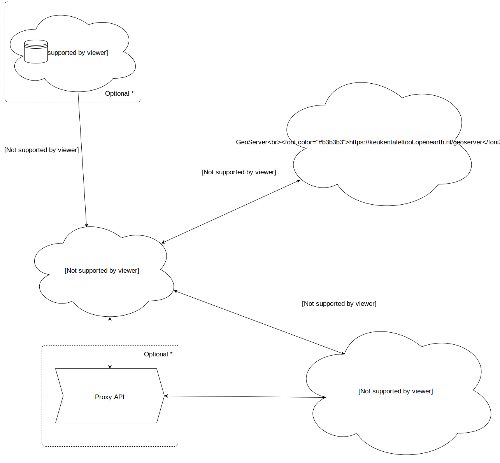

# Keukentafeltool

The keukentafeltool is a web app that helps (advisors of) farmers and waterboards ("waterschappen") to consider what are the most effective agricultaral measures,
to improve water quality. 

The project is a collaboration between Deltares and Wageningen University & Research (WUR).

## Architecture

* The Keukentafeltool is a universal [Vue.js](https://vuejs.org/) app made with [Nuxt.js](https://nuxtjs.org/).  The app uses [Vue Material](https://vuematerial.io/) as UI library and [Mapbox GL](https://www.mapbox.com/mapbox-gl-js/api/) as Map library. 
* The app is deployed on [Netlify](https://www.netlify.com/).
* App uses geo data from a Deltares GeoServer.
* App uses Hydrometra API to calculate effect of measures on parcels.



## Development

### Getting started

* Clone the repository.
* Copy `.env.example` to `.env` and set the environment variables. Copy them from the [Netlify build configuration](https://app.netlify.com/sites/keukentafeltool/settings/deploys#build-environment-variables) or ask your tech lead. 
* Run app in development mode (`npm run dev`), see [scripts](#scripts).
* Changes on master trigger a new build and deploy to the [live environment](https://keukentafeltool.netlify.com).

### Structure

```
dist/             <- generated app
  client/         <- generated client-side app

src/              <- source files
  client/         <- Nuxt app
    assets/       <- core files, not public
    components/   <- Vue components
    layouts/      <- base layout for pages
    pages/        <- view per route
    static/       <- public assets
  server/
    functions/    <- Netlify cloud functions
    lib/          <- shared cloud function helpers

.env              <- local environment variables
netlify.toml      <- Netlify build
nuxt.config.js    <- Nuxt app config
```

### Scripts

This project requires [Node.js](http://nodejs.org/) (>= v8) and [npm](https://npmjs.org/) (comes with Node).

After installing dependencies using `npm install` the following scripts are available:

`npm run ...` | Description
---|---
`analyze` | Analyze the bundles created during build.
`build` | Builds client, guide and server for production to `dist/`.
`dev` | Serves client app on [`http://localhost:2637`](http://localhost:2637) ("boer" in T9) with hot reloading.
`start` | Serves production version of client app from (`/dist/`) on [`http://localhost:2637`](http://localhost:2637).

## License

[GNU General Public License v3.0](license) (GNU GPLv3) © [Deltares](https://www.deltares.nl) and [De Voorhoede](https://www.voorhoede.nl)
